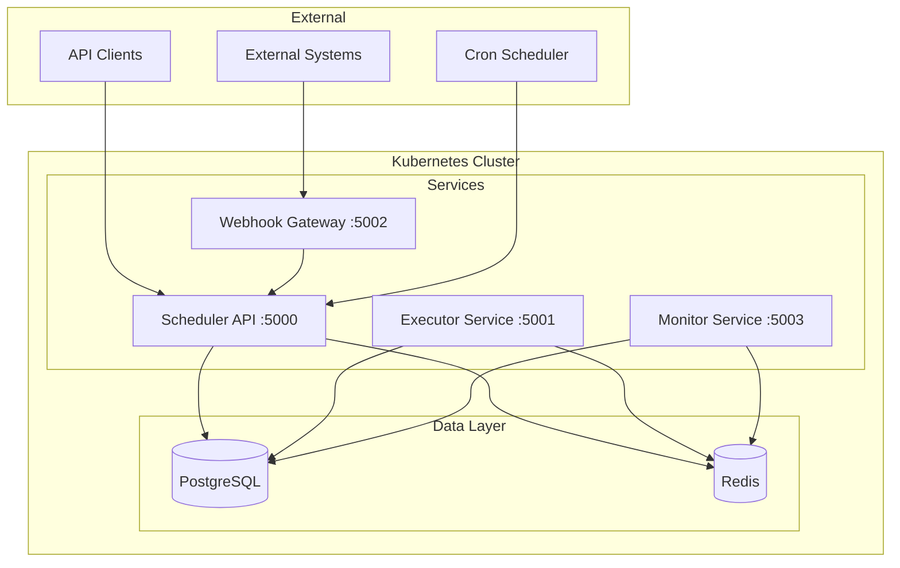
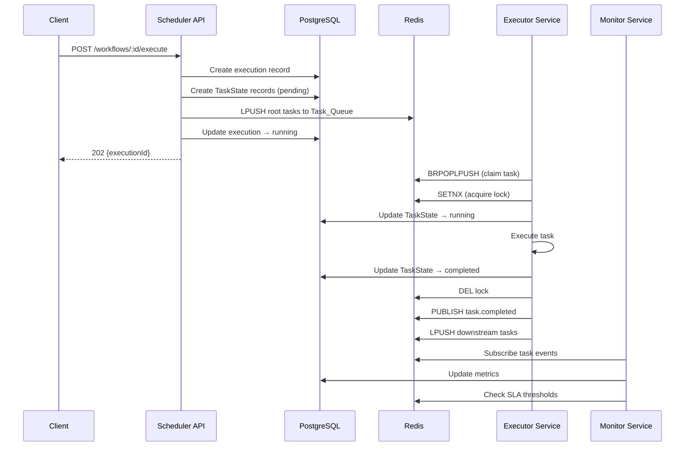

# Design Document: Task Orchestrator Engine

## Overview

The Task Orchestrator Engine is a distributed platform for scheduling, executing, and monitoring DAG-based workflows. The system is composed of four TypeScript/Node.js microservices communicating via REST APIs and Redis messaging, backed by PostgreSQL for persistence and Redis for queuing, locking, and caching.

### Architecture Style

- **Microservices**: Four independently deployable services with distinct responsibilities
- **Event-driven**: Redis pub/sub and queues for asynchronous task coordination
- **Shared-nothing**: Each service owns its data domain; cross-service communication is via APIs or message queues
- **Stateless compute**: Services hold no in-memory state beyond active task execution; all durable state lives in PostgreSQL/Redis

### Technology Stack

- **Runtime**: Node.js 20 with TypeScript
- **Framework**: Express.js for HTTP APIs
- **Database**: PostgreSQL 15 for persistent storage
- **Cache/Queue**: Redis 7 for task queues, distributed locks, heartbeats, and metric caching
- **Testing**: Jest + fast-check for property-based testing, testcontainers-node for integration tests
- **Containerization**: Docker with multi-stage builds (Node.js 20 Alpine)
- **Orchestration**: Kubernetes 1.29
- **CI/CD**: GitHub Actions

## Architecture

### System Architecture Diagram



### Service Responsibilities

| Service | Port | Responsibilities |
|---------|------|-----------------|
| Scheduler API | 5000 | Workflow CRUD, DAG validation, execution lifecycle, schedule management, trigger configuration |
| Executor Service | 5001 | Task claiming from queue, distributed lock management, task execution, retry handling, heartbeats |
| Webhook Gateway | 5002 | Webhook ingestion, HMAC-SHA256 validation, payload validation, forwarding to Scheduler API |
| Monitor Service | 5003 | Metrics aggregation, SLA tracking, alerting, executor health monitoring |

### Communication Patterns

1. **Synchronous (REST)**: Client → Scheduler API, Webhook Gateway → Scheduler API, Client → Monitor Service
2. **Asynchronous (Redis Queue)**: Scheduler API → Task_Queue → Executor Service
3. **Pub/Sub (Redis)**: Executor Service → task completion events → Scheduler API/Monitor Service
4. **Polling (Redis)**: Monitor Service polls executor heartbeats; Scheduler API polls for orphaned tasks

### Sequence: Workflow Execution



## Components and Interfaces

### Scheduler API (Port 5000)

**Endpoints:**

| Method | Path | Description |
|--------|------|-------------|
| POST | /api/v1/workflows | Create workflow |
| GET | /api/v1/workflows | List workflows (paginated) |
| GET | /api/v1/workflows/:id | Get workflow by ID |
| PUT | /api/v1/workflows/:id | Update workflow |
| DELETE | /api/v1/workflows/:id | Delete workflow |
| POST | /api/v1/workflows/:id/execute | Execute workflow |
| GET | /api/v1/executions/:id | Get execution status |
| POST | /api/v1/executions/:id/cancel | Cancel execution |
| POST | /api/v1/schedules | Create schedule |
| GET | /api/v1/schedules | List schedules |
| PATCH | /api/v1/schedules/:id | Update schedule |
| GET | /health | Health check |

**Internal Modules:**
- `DAGValidator` — Validates workflow graph structure (cycle detection, reachability, edge validity)
- `TopologicalSorter` — Computes execution order via DFS-based topological sort
- `ScheduleEvaluator` — Computes next run times from cron expressions/intervals
- `ExecutionManager` — Manages execution lifecycle and task state coordination
- `OrphanDetector` — Detects stalled tasks from unhealthy executors

### Executor Service (Port 5001)

**Endpoints:**

| Method | Path | Description |
|--------|------|-------------|
| GET | /health | Health check |

**Internal Modules:**
- `TaskClaimer` — Claims tasks from Redis queue with distributed locking
- `TaskRunner` — Executes claimed tasks with timeout enforcement
- `RetryEngine` — Computes retry delays and manages retry attempts
- `LockManager` — Acquires, renews, and releases Redis distributed locks
- `HeartbeatEmitter` — Sends periodic heartbeats to Redis
- `StateMachine` — Enforces valid task state transitions
- `FanOutFanIn` — Evaluates downstream dependencies and enqueues ready tasks

### Webhook Gateway (Port 5002)

**Endpoints:**

| Method | Path | Description |
|--------|------|-------------|
| POST | /api/v1/webhooks/:id | Receive webhook |
| GET | /health | Health check |

**Internal Modules:**
- `HMACValidator` — Validates HMAC-SHA256 signatures
- `PayloadValidator` — Validates JSON payloads (structure, size)
- `WebhookForwarder` — Forwards validated requests to Scheduler API

### Monitor Service (Port 5003)

**Endpoints:**

| Method | Path | Description |
|--------|------|-------------|
| GET | /api/v1/monitor/metrics | Get execution metrics |
| GET | /api/v1/monitor/executors | Get executor health |
| GET | /api/v1/monitor/dashboard | Get aggregated dashboard |
| GET | /api/v1/monitor/alerts | Get alerts |
| POST | /api/v1/monitor/sla-configs | Create SLA config |
| GET | /health | Health check |

**Internal Modules:**
- `MetricsAggregator` — Computes execution metrics over sliding windows
- `SLAChecker` — Polls running executions against SLA thresholds
- `AlertManager` — Emits, stores, and resolves alerts
- `ExecutorHealthTracker` — Monitors heartbeats and detects unhealthy executors

## Data Models

### PostgreSQL Schema

```sql
-- Workflows
CREATE TABLE workflows (
    id UUID PRIMARY KEY DEFAULT gen_random_uuid(),
    name VARCHAR(255) NOT NULL,
    description TEXT,
    trigger_config JSONB NOT NULL DEFAULT '{"type": "manual"}',
    created_at TIMESTAMPTZ NOT NULL DEFAULT NOW(),
    updated_at TIMESTAMPTZ NOT NULL DEFAULT NOW()
);

-- Task Definitions (nodes in the DAG)
CREATE TABLE task_definitions (
    id UUID PRIMARY KEY DEFAULT gen_random_uuid(),
    workflow_id UUID NOT NULL REFERENCES workflows(id) ON DELETE CASCADE,
    name VARCHAR(255) NOT NULL,
    type VARCHAR(50) NOT NULL,
    config JSONB NOT NULL DEFAULT '{}',
    timeout_ms INTEGER NOT NULL DEFAULT 300000,
    retry_policy JSONB,  -- {strategy, maxAttempts, baseDelay}
    created_at TIMESTAMPTZ NOT NULL DEFAULT NOW()
);
CREATE INDEX idx_task_definitions_workflow ON task_definitions(workflow_id);

-- Edges (directed connections between task definitions)
CREATE TABLE edges (
    id UUID PRIMARY KEY DEFAULT gen_random_uuid(),
    workflow_id UUID NOT NULL REFERENCES workflows(id) ON DELETE CASCADE,
    source_task_id UUID NOT NULL REFERENCES task_definitions(id) ON DELETE CASCADE,
    target_task_id UUID NOT NULL REFERENCES task_definitions(id) ON DELETE CASCADE,
    condition_expr TEXT,
    created_at TIMESTAMPTZ NOT NULL DEFAULT NOW(),
    UNIQUE(workflow_id, source_task_id, target_task_id)
);
CREATE INDEX idx_edges_workflow ON edges(workflow_id);
CREATE INDEX idx_edges_source ON edges(source_task_id);
CREATE INDEX idx_edges_target ON edges(target_task_id);

-- Executions (runtime workflow instances)
CREATE TABLE executions (
    id UUID PRIMARY KEY DEFAULT gen_random_uuid(),
    workflow_id UUID NOT NULL REFERENCES workflows(id),
    status VARCHAR(20) NOT NULL DEFAULT 'pending'
        CHECK (status IN ('pending', 'running', 'completed', 'failed', 'cancelled')),
    input JSONB,
    started_at TIMESTAMPTZ,
    completed_at TIMESTAMPTZ,
    created_at TIMESTAMPTZ NOT NULL DEFAULT NOW()
);
CREATE INDEX idx_executions_workflow ON executions(workflow_id);
CREATE INDEX idx_executions_status ON executions(status);

-- Task States (runtime task instances within an execution)
CREATE TABLE task_states (
    id UUID PRIMARY KEY DEFAULT gen_random_uuid(),
    execution_id UUID NOT NULL REFERENCES executions(id) ON DELETE CASCADE,
    task_definition_id UUID NOT NULL REFERENCES task_definitions(id),
    status VARCHAR(20) NOT NULL DEFAULT 'pending'
        CHECK (status IN ('pending', 'running', 'completed', 'failed', 'cancelled', 'timed_out', 'skipped')),
    attempt_count INTEGER NOT NULL DEFAULT 0,
    output JSONB,
    error TEXT,
    started_at TIMESTAMPTZ,
    completed_at TIMESTAMPTZ,
    created_at TIMESTAMPTZ NOT NULL DEFAULT NOW()
);
CREATE INDEX idx_task_states_execution ON task_states(execution_id);
CREATE INDEX idx_task_states_status ON task_states(status);

-- Task State Audit Log
CREATE TABLE task_state_audit (
    id UUID PRIMARY KEY DEFAULT gen_random_uuid(),
    task_state_id UUID NOT NULL REFERENCES task_states(id) ON DELETE CASCADE,
    previous_state VARCHAR(20) NOT NULL,
    new_state VARCHAR(20) NOT NULL,
    timestamp TIMESTAMPTZ NOT NULL DEFAULT NOW()
);
CREATE INDEX idx_audit_task_state ON task_state_audit(task_state_id);

-- Schedules
CREATE TABLE schedules (
    id UUID PRIMARY KEY DEFAULT gen_random_uuid(),
    workflow_id UUID NOT NULL REFERENCES workflows(id) ON DELETE CASCADE,
    cron_expr VARCHAR(100),
    interval_ms INTEGER CHECK (interval_ms IS NULL OR (interval_ms >= 1000 AND interval_ms <= 86400000)),
    timezone VARCHAR(50) DEFAULT 'UTC',
    active BOOLEAN NOT NULL DEFAULT TRUE,
    last_run_at TIMESTAMPTZ,
    next_run_at TIMESTAMPTZ,
    created_at TIMESTAMPTZ NOT NULL DEFAULT NOW(),
    CHECK (cron_expr IS NOT NULL OR interval_ms IS NOT NULL)
);
CREATE INDEX idx_schedules_workflow ON schedules(workflow_id);
CREATE INDEX idx_schedules_next_run ON schedules(next_run_at) WHERE active = TRUE;

-- Webhook Registrations
CREATE TABLE webhook_registrations (
    id UUID PRIMARY KEY DEFAULT gen_random_uuid(),
    workflow_id UUID NOT NULL REFERENCES workflows(id) ON DELETE CASCADE,
    secret VARCHAR(255),
    active BOOLEAN NOT NULL DEFAULT TRUE,
    created_at TIMESTAMPTZ NOT NULL DEFAULT NOW()
);
CREATE INDEX idx_webhooks_workflow ON webhook_registrations(workflow_id);

-- Dead Letter Queue
CREATE TABLE dead_letter_queue (
    id UUID PRIMARY KEY DEFAULT gen_random_uuid(),
    task_state_id UUID NOT NULL REFERENCES task_states(id),
    execution_id UUID NOT NULL REFERENCES executions(id),
    error TEXT,
    attempts INTEGER NOT NULL,
    created_at TIMESTAMPTZ NOT NULL DEFAULT NOW()
);

-- SLA Configurations
CREATE TABLE sla_configs (
    id UUID PRIMARY KEY DEFAULT gen_random_uuid(),
    workflow_id UUID NOT NULL REFERENCES workflows(id) ON DELETE CASCADE,
    max_duration_ms INTEGER NOT NULL CHECK (max_duration_ms >= 1000),
    warning_threshold_pct INTEGER NOT NULL DEFAULT 80 CHECK (warning_threshold_pct > 0 AND warning_threshold_pct < 100),
    created_at TIMESTAMPTZ NOT NULL DEFAULT NOW()
);
CREATE INDEX idx_sla_configs_workflow ON sla_configs(workflow_id);

-- Alerts
CREATE TABLE alerts (
    id UUID PRIMARY KEY DEFAULT gen_random_uuid(),
    execution_id UUID NOT NULL REFERENCES executions(id),
    workflow_id UUID NOT NULL REFERENCES workflows(id),
    severity VARCHAR(20) NOT NULL CHECK (severity IN ('warning', 'critical')),
    message TEXT NOT NULL,
    elapsed_ms INTEGER NOT NULL,
    sla_limit_ms INTEGER NOT NULL,
    resolved BOOLEAN NOT NULL DEFAULT FALSE,
    resolved_at TIMESTAMPTZ,
    created_at TIMESTAMPTZ NOT NULL DEFAULT NOW()
);
CREATE INDEX idx_alerts_execution ON alerts(execution_id);
CREATE INDEX idx_alerts_created ON alerts(created_at);
CREATE INDEX idx_alerts_severity ON alerts(severity);
```

### Redis Data Structures

| Key Pattern | Type | Purpose | TTL |
|-------------|------|---------|-----|
| `task_queue` | List | FIFO queue of task_state IDs ready for execution | None |
| `task_processing` | List | Tasks currently being processed (BRPOPLPUSH destination) | None |
| `lock:task:{taskStateId}` | String | Distributed lock; value = executor ID | 30s |
| `heartbeat:{executorId}` | Hash | Executor heartbeat data (timestamp, taskCount, maxCapacity) | 90s |
| `metrics:cache` | String (JSON) | Cached aggregated metrics | 10s |
| `schedule:last_run:{scheduleId}` | String | Timestamp of last schedule execution | None |
| `channel:task.completed` | Pub/Sub | Task completion events | N/A |
| `channel:task.failed` | Pub/Sub | Task failure events | N/A |

### TypeScript Interfaces

```typescript
// Core Domain Types
interface Workflow {
  id: string;
  name: string;
  description?: string;
  taskDefinitions: TaskDefinition[];
  edges: Edge[];
  triggerConfig: TriggerConfig;
  createdAt: Date;
  updatedAt: Date;
}

interface TaskDefinition {
  id: string;
  workflowId: string;
  name: string;
  type: string;
  config: Record<string, unknown>;
  timeoutMs: number;
  retryPolicy?: RetryPolicy;
}

interface Edge {
  id: string;
  workflowId: string;
  sourceTaskId: string;
  targetTaskId: string;
  conditionExpr?: string;
}

interface RetryPolicy {
  strategy: 'fixed' | 'exponential' | 'linear';
  maxAttempts: number;  // 1-10
  baseDelay: number;    // 100-300000 ms
}

interface Execution {
  id: string;
  workflowId: string;
  status: ExecutionStatus;
  input?: Record<string, unknown>;
  startedAt?: Date;
  completedAt?: Date;
  createdAt: Date;
}

type ExecutionStatus = 'pending' | 'running' | 'completed' | 'failed' | 'cancelled';

interface TaskState {
  id: string;
  executionId: string;
  taskDefinitionId: string;
  status: TaskStatus;
  attemptCount: number;
  output?: Record<string, unknown>;
  error?: string;
  startedAt?: Date;
  completedAt?: Date;
}

type TaskStatus = 'pending' | 'running' | 'completed' | 'failed' | 'cancelled' | 'timed_out' | 'skipped';

interface TriggerConfig {
  type: 'manual' | 'schedule' | 'webhook' | 'event';
  scheduleId?: string;
  eventPattern?: string;
}

interface Schedule {
  id: string;
  workflowId: string;
  cronExpr?: string;
  intervalMs?: number;
  timezone: string;
  active: boolean;
  lastRunAt?: Date;
  nextRunAt?: Date;
  createdAt: Date;
}

interface WebhookRegistration {
  id: string;
  workflowId: string;
  secret?: string;
  active: boolean;
  createdAt: Date;
}

interface SLAConfig {
  id: string;
  workflowId: string;
  maxDurationMs: number;
  warningThresholdPct: number;
}

interface Alert {
  id: string;
  executionId: string;
  workflowId: string;
  severity: 'warning' | 'critical';
  message: string;
  elapsedMs: number;
  slaLimitMs: number;
  resolved: boolean;
  resolvedAt?: Date;
  createdAt: Date;
}

interface ExecutorHeartbeat {
  executorId: string;
  timestamp: Date;
  currentTaskCount: number;
  maxCapacity: number;
}

interface ExecutionMetrics {
  activeExecutionCount: number;
  successRatePct: number;       // over last 60 minutes
  avgDurationMs: number;        // over last 60 minutes
  throughputPerMinute: number;  // completed per minute over last 60 minutes
}
```

## Core Algorithms

### DAG Validation and Topological Sort

The DAG validator performs three checks:
1. **Edge reference validity** — All source/target IDs in edges reference existing task definitions
2. **Cycle detection** — DFS-based detection using white/gray/black coloring
3. **Reachability** — All nodes are reachable from root nodes (nodes with no incoming edges)

```typescript
// Pseudocode: DFS-based cycle detection and topological sort
function validateAndSort(tasks: TaskDefinition[], edges: Edge[]): TaskDefinition[] | CycleError {
  const adjacency = buildAdjacencyList(tasks, edges);
  const WHITE = 0, GRAY = 1, BLACK = 2;
  const color = new Map<string, number>();  // all start WHITE
  const order: string[] = [];

  for (const task of tasks) {
    color.set(task.id, WHITE);
  }

  for (const task of tasks) {
    if (color.get(task.id) === WHITE) {
      const cycleNodes = dfs(task.id, adjacency, color, order);
      if (cycleNodes) return { error: 'cycle_detected', nodes: cycleNodes };
    }
  }

  // order is in reverse topological order (post-order DFS)
  return order.reverse().map(id => tasks.find(t => t.id === id)!);
}

function dfs(nodeId, adjacency, color, order): string[] | null {
  color.set(nodeId, GRAY);
  for (const neighbor of adjacency.get(nodeId) || []) {
    if (color.get(neighbor) === GRAY) {
      return [nodeId, neighbor]; // cycle detected
    }
    if (color.get(neighbor) === WHITE) {
      const cycle = dfs(neighbor, adjacency, color, order);
      if (cycle) return cycle;
    }
  }
  color.set(nodeId, BLACK);
  order.push(nodeId);
  return null;
}

function checkReachability(tasks: TaskDefinition[], edges: Edge[]): string[] {
  const incomingCount = new Map<string, number>();
  tasks.forEach(t => incomingCount.set(t.id, 0));
  edges.forEach(e => incomingCount.set(e.targetTaskId, (incomingCount.get(e.targetTaskId) || 0) + 1));
  
  const roots = tasks.filter(t => incomingCount.get(t.id) === 0);
  const visited = new Set<string>();
  const queue = roots.map(r => r.id);
  
  while (queue.length > 0) {
    const current = queue.shift()!;
    if (visited.has(current)) continue;
    visited.add(current);
    const neighbors = edges.filter(e => e.sourceTaskId === current).map(e => e.targetTaskId);
    queue.push(...neighbors);
  }
  
  return tasks.filter(t => !visited.has(t.id)).map(t => t.id); // unreachable nodes
}
```

### DAG Serialization Round-Trip

For the round-trip property, the DAG is serialized as:
- **Tasks**: Array of `{id, name, type}` objects sorted by ID
- **Edges**: Array of `{sourceTaskId, targetTaskId, conditionExpr}` objects sorted by `(sourceTaskId, targetTaskId)`

Parsing reconstructs the graph from this canonical form. The round-trip property guarantees that `parse(serialize(dag))` produces an equivalent graph (same task IDs and same edges).

### Distributed Task Claiming

```typescript
// Pseudocode: Atomic task claiming with Redis
async function claimTask(executorId: string, redis: Redis): Promise<string | null> {
  // Atomically move task from queue to processing list
  const taskStateId = await redis.brpoplpush('task_queue', 'task_processing', 5);
  if (!taskStateId) return null;

  // Attempt to acquire distributed lock
  const lockKey = `lock:task:${taskStateId}`;
  const acquired = await redis.set(lockKey, executorId, 'NX', 'PX', 30000);
  
  if (!acquired) {
    // Lock held by another executor; re-enqueue
    await redis.lrem('task_processing', 1, taskStateId);
    await redis.lpush('task_queue', taskStateId);
    return null;
  }

  return taskStateId;
}

// Lock renewal loop (runs every 10 seconds)
async function renewLock(taskStateId: string, executorId: string, redis: Redis): Promise<boolean> {
  const lockKey = `lock:task:${taskStateId}`;
  // Only renew if we still own the lock
  const script = `
    if redis.call("get", KEYS[1]) == ARGV[1] then
      return redis.call("pexpire", KEYS[1], ARGV[2])
    else
      return 0
    end
  `;
  const result = await redis.eval(script, 1, lockKey, executorId, '30000');
  return result === 1;
}
```

### Retry Delay Calculation

```typescript
function calculateRetryDelay(policy: RetryPolicy, attemptNumber: number): number {
  const MAX_DELAY = 300000; // 300 seconds

  switch (policy.strategy) {
    case 'fixed':
      return policy.baseDelay;
    case 'exponential':
      return Math.min(policy.baseDelay * Math.pow(2, attemptNumber - 1), MAX_DELAY);
    case 'linear':
      return Math.min(policy.baseDelay * attemptNumber, MAX_DELAY);
  }
}
```

### Cron Next-Run Calculation

The cron evaluator parses 5-field cron expressions (minute, hour, day-of-month, month, day-of-week) and computes the next timestamp strictly greater than a reference time. The implementation uses a field-by-field forward scan:

1. Start from reference time + 1 minute (rounded down to minute boundary)
2. For each field (month, day-of-month, day-of-week, hour, minute): if current value doesn't match, advance to next matching value, reset lower fields
3. If any field overflows, increment the next higher field and restart
4. Guarantee: result > reference (never equal)

### HMAC-SHA256 Webhook Validation

```typescript
function validateWebhookSignature(
  payload: Buffer,
  signatureHeader: string,
  secret: string
): boolean {
  const expectedSignature = crypto
    .createHmac('sha256', secret)
    .update(payload)
    .digest('hex');
  
  const providedSignature = signatureHeader.replace('sha256=', '');
  return crypto.timingSafeEqual(
    Buffer.from(expectedSignature, 'hex'),
    Buffer.from(providedSignature, 'hex')
  );
}
```

### Fan-Out/Fan-In Logic

```typescript
// After a task completes, determine which downstream tasks are ready
async function evaluateDownstream(
  completedTaskId: string,
  execution: Execution,
  edges: Edge[],
  taskStates: Map<string, TaskState>
): Promise<string[]> {
  const outgoing = edges.filter(e => e.sourceTaskId === completedTaskId);
  const readyTasks: string[] = [];

  for (const edge of outgoing) {
    // Evaluate condition if present
    if (edge.conditionExpr) {
      const upstream = taskStates.get(completedTaskId)!;
      const conditionResult = evaluateCondition(edge.conditionExpr, upstream.output);
      if (!conditionResult) {
        await markSkipped(edge.targetTaskId, taskStates, edges);
        continue;
      }
    }

    // Check if all incoming edges to target are satisfied
    const incomingToTarget = edges.filter(e => e.targetTaskId === edge.targetTaskId);
    const allSatisfied = incomingToTarget.every(inc => {
      const upstreamState = taskStates.get(inc.sourceTaskId)!;
      return ['completed', 'skipped'].includes(upstreamState.status);
    });

    const atLeastOneCompleted = incomingToTarget.some(inc => {
      const upstreamState = taskStates.get(inc.sourceTaskId)!;
      return upstreamState.status === 'completed';
    });

    if (allSatisfied && atLeastOneCompleted) {
      readyTasks.push(edge.targetTaskId);
    }
  }

  return readyTasks;
}
```

## Infrastructure Design

### Docker Multi-Stage Build

```dockerfile
# Stage 1: Build
FROM node:20-alpine AS builder
WORKDIR /app
COPY package*.json tsconfig.json ./
COPY src/ ./src/
RUN npm ci && npm run build

# Stage 2: Production
FROM node:20-alpine AS production
WORKDIR /app
ENV NODE_ENV=production
COPY package*.json ./
RUN npm ci --production && npm cache clean --force
COPY --from=builder /app/dist ./dist
USER node
EXPOSE ${PORT}
CMD ["node", "dist/index.js"]
```

### Kubernetes Deployment Pattern

Each service follows the same deployment pattern:
- **Deployment**: 2 replicas, rolling update strategy
- **Service**: ClusterIP for internal, LoadBalancer for Webhook Gateway
- **Resource requests**: 128Mi memory, 100m CPU
- **Resource limits**: 512Mi memory, 500m CPU
- **Probes**: Readiness (GET /health, initialDelay=10s, period=5s), Liveness (GET /health, initialDelay=15s, period=10s)
- **PodDisruptionBudget**: minAvailable=1

### Network Policy

- Scheduler API, Executor Service, Monitor Service → PostgreSQL, Redis: **ALLOW**
- Webhook Gateway → Scheduler API: **ALLOW**
- Default: **DENY** all inter-pod traffic

### CI/CD Pipeline (GitHub Actions)

```yaml
# Jobs execute in parallel where possible
jobs:
  typecheck-build:
    # tsc --noEmit for each service
  unit-tests:
    # jest --coverage, fail if < 80% line coverage
  trivy-scan:
    # Build images, scan with trivy severity HIGH,CRITICAL
  kubeconform:
    # Validate k8s manifests against v1.29 schemas
```


## Correctness Properties

*A property is a characteristic or behavior that should hold true across all valid executions of a system — essentially, a formal statement about what the system should do. Properties serve as the bridge between human-readable specifications and machine-verifiable correctness guarantees.*

### Property 1: DAG Cycle Detection Correctness

*For any* randomly generated directed graph with 1 to 50 nodes and 0 to 200 edges, the DAG validator SHALL reject the graph if and only if it contains a cycle. Equivalently: all acyclic graphs are accepted, and all cyclic graphs are rejected.

**Validates: Requirements 2.1, 2.2, 16.1**

### Property 2: Topological Sort Ordering Validity

*For any* valid DAG with 1 to 50 nodes, the topological sort output SHALL contain exactly the same set of node identifiers as the input, and for every directed edge (u, v) in the graph, u SHALL appear before v in the output ordering.

**Validates: Requirements 2.1, 16.2**

### Property 3: DAG Reachability from Roots

*For any* valid DAG accepted by the validator, all task definition nodes SHALL be reachable from at least one root node (a node with zero incoming edges) via directed edges.

**Validates: Requirements 2.5**

### Property 4: DAG Serialization Round-Trip

*For any* valid workflow DAG, serializing the graph to its canonical form (sorted task IDs and sorted edges) and then parsing it back SHALL produce a graph with an identical set of task definition identifiers and an identical set of directed edges.

**Validates: Requirements 2.6**

### Property 5: Task State Machine Transition Validity

*For any* pair of task states (currentState, targetState) drawn from {pending, running, completed, failed, cancelled, timed_out}, the state machine SHALL accept the transition if and only if it is in the set of valid transitions {pending→running, running→completed, running→failed, running→cancelled, running→timed_out, pending→cancelled}. All other transitions SHALL be rejected, and for every accepted transition an audit entry SHALL be recorded containing the correct previous state, new state, and a timestamp.

**Validates: Requirements 4.2, 4.3, 4.4, 4.5, 16.4**

### Property 6: Retry Delay Formula Correctness

*For any* retry policy with strategy in {fixed, exponential, linear}, maxAttempts in [1, 10], baseDelay in [100, 300000] ms, and attemptNumber in [1, maxAttempts], the computed delay SHALL exactly equal:
- Fixed: `baseDelay`
- Exponential: `min(baseDelay × 2^(attemptNumber - 1), 300000)`
- Linear: `min(baseDelay × attemptNumber, 300000)`

**Validates: Requirements 7.1, 7.2, 7.3, 16.3**

### Property 7: Distributed Task Claiming Exactly-Once Semantics

*For any* number of concurrent executor instances (2 to 10) simultaneously attempting to claim the same task via Redis SETNX, exactly one executor SHALL successfully acquire the lock and no two executors SHALL both believe they hold the lock for the same task.

**Validates: Requirements 5.7, 16.5**

### Property 8: Cron Next-Run Monotonicity

*For any* valid 5-field cron expression and any reference timestamp, the computed next run time SHALL be strictly greater than the reference timestamp (never equal, never less).

**Validates: Requirements 9.6, 16.6**

### Property 9: HMAC-SHA256 Webhook Signature Validation

*For any* random payload and secret, computing the HMAC-SHA256 signature and validating it SHALL succeed, and modifying any single byte of the payload or signature SHALL cause validation to fail.

**Validates: Requirements 11.2, 11.3**

## Error Handling

### Error Response Format

All services return errors in a consistent JSON format:

```json
{
  "error": {
    "code": "VALIDATION_ERROR",
    "message": "Human-readable description",
    "details": {}
  }
}
```

### Error Categories

| Code | HTTP Status | Description |
|------|-------------|-------------|
| `NOT_FOUND` | 404 | Resource does not exist |
| `VALIDATION_ERROR` | 400 | Request payload validation failed |
| `CONFLICT` | 409 | Operation conflicts with current state |
| `UNPROCESSABLE_ENTITY` | 422 | Semantically invalid (valid JSON but invalid values) |
| `UNAUTHORIZED` | 401 | HMAC signature invalid or missing |
| `BAD_GATEWAY` | 502 | Upstream service unavailable |
| `INTERNAL_ERROR` | 500 | Unexpected server error |

### Service-Specific Error Handling

**Scheduler API:**
- DAG cycle detected → 400 with node IDs in cycle
- Invalid edge references → 400 with invalid edge details
- Workflow has active executions on delete → 409
- Invalid cron expression or interval → 422

**Executor Service:**
- Invalid state transition → reject silently, preserve state, log warning
- Lock acquisition failure → re-enqueue task, continue polling
- Lock renewal failure → abort task execution, release partial results
- Task timeout → transition to timed_out, release lock

**Webhook Gateway:**
- Invalid HMAC → 401 (no details to prevent information leakage)
- Payload > 1MB or invalid JSON → 400
- Scheduler API unreachable → 502

**Monitor Service:**
- No data available → return zero-value metrics (never error)
- SLA check failure → log error, continue checking other executions

### Retry and Recovery Patterns

1. **Task execution retry**: Governed by RetryPolicy (fixed/exponential/linear)
2. **Orphan task recovery**: Scheduler API polls processing list every 60s, re-enqueues tasks whose locks expired
3. **Unhealthy executor recovery**: Monitor Service detects missing heartbeats (>90s), Scheduler API releases locks and re-enqueues
4. **Infrastructure retry**: Re-enqueue failures retry 3× with 1s delay
5. **Dead Letter Queue**: Tasks exhausting all retries are moved to DLQ for manual inspection

## Testing Strategy

### Testing Pyramid

```
         ╱╲
        ╱  ╲       Integration Tests (testcontainers)
       ╱────╲      - End-to-end workflow execution
      ╱      ╲     - Multi-service interaction
     ╱────────╲    
    ╱          ╲   Property-Based Tests (fast-check)
   ╱────────────╲  - DAG validation, topo sort
  ╱              ╲ - State machine, retry, cron
 ╱────────────────╲
╱                  ╲ Unit Tests (Jest)
╱────────────────────╲ - Individual functions, edge cases
```

### Property-Based Testing (fast-check)

**Library**: [fast-check](https://github.com/dubzzz/fast-check) for TypeScript property-based testing.

**Configuration**:
- Minimum 100 generated test cases per property
- Each test tagged with feature and property reference

**Tag Format**: `Feature: task-orchestrator-engine, Property N: <property title>`

**Properties to Implement**:

| # | Property | Module Under Test |
|---|----------|-------------------|
| 1 | DAG Cycle Detection Correctness | `DAGValidator` |
| 2 | Topological Sort Ordering Validity | `TopologicalSorter` |
| 3 | DAG Reachability from Roots | `DAGValidator` |
| 4 | DAG Serialization Round-Trip | `DAGSerializer` |
| 5 | Task State Machine Transition Validity | `StateMachine` |
| 6 | Retry Delay Formula Correctness | `RetryEngine` |
| 7 | Distributed Task Claiming Exactly-Once | `TaskClaimer` (with mock Redis) |
| 8 | Cron Next-Run Monotonicity | `ScheduleEvaluator` |
| 9 | HMAC-SHA256 Validation | `HMACValidator` |

**Custom Generators**:

```typescript
// DAG generator: produces random valid DAGs
const dagArbitrary = fc.tuple(
  fc.integer({ min: 1, max: 50 }),  // node count
  fc.integer({ min: 0, max: 200 })  // max edges
).chain(([nodeCount, maxEdges]) => {
  // Generate nodes with unique IDs
  // Generate edges only from lower-index to higher-index nodes (guarantees acyclicity)
  // Return { nodes, edges }
});

// Cyclic graph generator: injects back-edges into valid DAGs
const cyclicGraphArbitrary = dagArbitrary.map(dag => {
  // Add at least one back-edge to create a cycle
});

// Retry policy generator
const retryPolicyArbitrary = fc.record({
  strategy: fc.constantFrom('fixed', 'exponential', 'linear'),
  maxAttempts: fc.integer({ min: 1, max: 10 }),
  baseDelay: fc.integer({ min: 100, max: 60000 })
});

// Cron expression generator (valid 5-field)
const cronArbitrary = fc.tuple(
  fc.constantFrom('*', ...range(0, 59).map(String)),   // minute
  fc.constantFrom('*', ...range(0, 23).map(String)),   // hour
  fc.constantFrom('*', ...range(1, 31).map(String)),   // day of month
  fc.constantFrom('*', ...range(1, 12).map(String)),   // month
  fc.constantFrom('*', ...range(0, 6).map(String))     // day of week
).map(fields => fields.join(' '));

// Task state pair generator
const stateTransitionArbitrary = fc.tuple(
  fc.constantFrom('pending', 'running', 'completed', 'failed', 'cancelled', 'timed_out'),
  fc.constantFrom('pending', 'running', 'completed', 'failed', 'cancelled', 'timed_out')
);
```

### Unit Tests (Jest)

Unit tests complement property tests by covering:
- Specific edge cases (empty inputs, boundary values)
- Error message content verification
- API request/response structure
- Individual function behavior with known inputs

**Coverage Requirement**: Minimum 80% line coverage across all services.

### Integration Tests (testcontainers-node)

Integration tests use real PostgreSQL and Redis containers to verify:
1. End-to-end workflow execution (3+ tasks with dependencies)
2. Fan-out/fan-in parallel execution
3. Retry behavior with actual delays (all 3 strategies)
4. Webhook-triggered execution
5. Schedule-triggered execution (simulated time)
6. Failure propagation to Dead Letter Queue

**Framework**: testcontainers-node for container lifecycle management.
**Timeout**: 30s per retry scenario, 60s for full workflow tests.

### Test Organization

```
tests/
├── unit/
│   ├── scheduler-api/
│   ├── executor-service/
│   ├── webhook-gateway/
│   └── monitor-service/
├── property/
│   ├── dag-validation.property.test.ts
│   ├── topological-sort.property.test.ts
│   ├── state-machine.property.test.ts
│   ├── retry-delay.property.test.ts
│   ├── task-claiming.property.test.ts
│   ├── cron-next-run.property.test.ts
│   └── hmac-validation.property.test.ts
└── integration/
    ├── workflow-execution.integration.test.ts
    ├── fan-out-fan-in.integration.test.ts
    ├── retry-strategies.integration.test.ts
    ├── webhook-trigger.integration.test.ts
    ├── schedule-trigger.integration.test.ts
    └── failure-propagation.integration.test.ts
```
